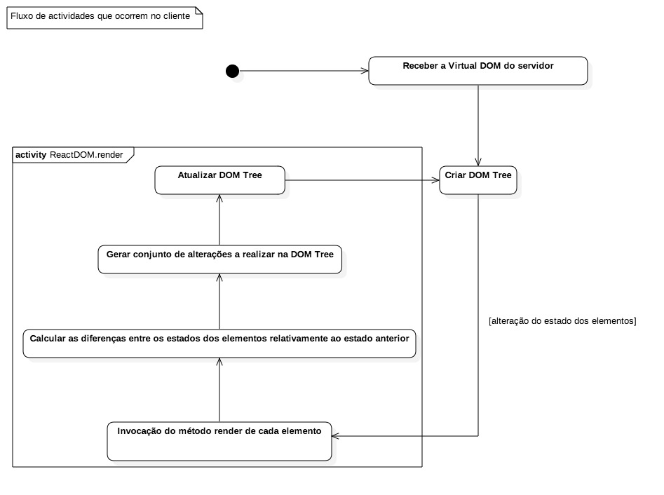
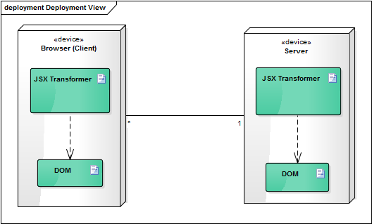

# Relatório 3 - ESOF
## Facebook/React - Arquitetura de *Software*

### <a name="introducao"></a>Introdução

O objetivo deste relatório é a explicitação de alguns aspetos relativos à arquitetura do projeto React, seguindo o [modelo de vistas 4+1](https://en.wikipedia.org/wiki/4%2B1_architectural_view_model). Serão apresentados vários diagramas exemplificativos.

Numa primeira fase, serão apresentados alguns conceitos sobre a biblioteca React considerados pertinentes para a compreensão do resto do relatório.

Numa segunda fase, serão apresentadas quatro componentes do modelo de vistas acima referido, nomeadamente o diagrama de componentes, referente à **vista de implementação**, o diagrama de pacotes do projeto, referente à **vista lógica**, o diagrama de atividades, referente à **vista de processo**, e o diagrama de *deployment*, referente à **vista de _deployment_**, isto é, à vista de distribuição dos componentes de *software* do projeto em componentes de *hardware*.

Note-se que o diagrama de casos de uso, correspondente à vista com a mesma designação, já foi apresentado no [relatório anterior](Relatorio_2.md#casos-de-uso).

### <a name="conceitos"></a>Conceitos

Nesta secção, serão explorados alguns conceitos importantes para a compreensão dos diagramas apresentados neste relatório.

#### <a name="virtual-dom"></a>*Virtual* DOM

A biblioteca React mantém uma representação em árvore dos elementos que serão mostrados pela aplicação, num conceito que é genericamente conhecido como [*Virtual* DOM](https://facebook.github.io/react/docs/glossary.html). Os [nós](https://facebook.github.io/react/docs/glossary.html#react-nodes) desta árvore podem ser [elementos](https://facebook.github.io/react/docs/glossary.html#react-elements), texto, valores numéricos ou um *array* de outros nós. Cada elemento pode conter descendentes, o que resulta numa estrutura em árvore. Como já foi referido no [relatório anterior](Relatorio_2.md#casos-de-uso), os elementos podem corresponder a *tags* de HTML ou, numa perspetiva mais interessante para quem utiliza a biblioteca, a [tipos de dados definidos pelo programador](https://facebook.github.io/react/docs/glossary.html#react-components).

Esta árvore será posteriormente traduzida numa árvore DOM inteligível pelo *browser*, que procederá à sua renderização com vista à apresentação da interface da aplicação. Esta tarefa de tradução da árvore virtual no DOM do documento é realizada através da classe [ReactDOM](https://facebook.github.io/react/docs/glossary.html#formal-type-definitions).

#### <a name="jsx"></a>Sintaxe JSX

[JSX](https://facebook.github.io/jsx/) é uma extensão sintática para JavaScript semelhante a XML, apresentando a vantagem de ser mais [intuitiva e familiar](https://facebook.github.io/jsx/#rationale) para a maior parte dos programadores, permitindo uma compreensão mais fácil da estrutura em árvore do DOM virtual da aplicação, devido ao equilíbrio de *tags* de início e de fim.

O recurso a esta sintaxe é recomendado, mas não [obrigatório](https://facebook.github.io/react/docs/jsx-in-depth.html#why-jsx). Na realidade, o React [transformará a sintaxe JSX](https://facebook.github.io/react/docs/jsx-in-depth.html#the-transform) em JavaScript puro, pelo que a sua utilização tem como único objetivo acelerar o processo de desenvolvimento de aplicações que façam uso da biblioteca.

O [exemplo seguinte](https://facebook.github.io/react/docs/jsx-in-depth.html#child-expressions) ilustra a utilização da sintaxe JSX.

```javascript
var content = <Container>{window.isLoggedIn ? <Nav /> : <Login />}</Container>;
```

O código anterior é traduzido no seguinte código em JavaScript puro.

```javascript
var content = React.createElement(
  Container,
  null,
  window.isLoggedIn ? React.createElement(Nav) : React.createElement(Login)
);
```

A comparação entre estes dois blocos de código mostra a vantagem da utilização da sintaxe JSX, que permite escrever código mais conciso e intuitivo.

### <a name="implementacao"></a>Vista de Implementação

Um [diagrama de componentes](https://en.wikipedia.org/wiki/Component_diagram) representa o modo como os componentes de um sistema de *software* estão relacionados entre si. Os componentes podem ser ligados por meio de um conector designado de *assembly connector*, que indica quais as interfaces fornecidas por um dado componente que são usadas por outros.

O diagrama de componentes seguinte concretiza a vista de implementação referente à biblioteca React.


#### <a name="interpretacao-implementacao"></a>Interpretação

De acordo com a interpretação dos autores deste relatório, a biblioteca React pode ser dividida em dois componentes essenciais. O primeiro componente incorpora as funcionalidades sobre as árvores DOM da página - a [árvore virtual](#virtual-dom) e a árvore do *browser* -, aspeto central na definição da biblioteca. Este componente trata os elementos definidos pelo utilizador - conforme explicado no [Relatório 2](./Relatorio_2.md#casos-de-uso) -, traduzindo-os numa árvore DOM que pode ser renderizada pelo *browser*. Como já foi referido em [relatórios anteriores](./Relatorio_2.md#isomorfismo-server-side-rendering), o processo de construção e atualização da árvore DOM é feito de forma muito eficiente, baseando-se na [determinação das diferenças](https://facebook.github.io/react/blog/2013/06/05/why-react.html#reactive-updates-are-dead-simple.) sofridas por cada elemento da interface.

O segundo componente integra o interpretador (*transformer*) de [JSX](https://facebook.github.io/react/docs/jsx-in-depth.html). A sintaxe JSX é [transformada](https://facebook.github.io/react/docs/jsx-in-depth.html#the-transform) em código JavaScript puro, pronto a ser executado pela aplicação cliente, conforme [já foi referido](#jsx).

É do entender dos autores deste relatório que existem distinções suficientes entre estes dois conjuntos de funcionalidades, justificando a sua classificação em dois componentes diferentes.

### <a name="logica"></a>Vista Lógica

O seguinte [diagrama de pacotes](https://en.wikipedia.org/wiki/Package_diagram) apresenta as principais abstrações do sistema, ilustrando os pacotes definidos e as dependências entre si e caracterizando a vista lógica referente ao projeto em estudo, o React.


#### <a name="interpretacao-logica"></a>Interpretação

A interpretação dos autores deste relatório no que diz respeito à visão lógica foi traduzida no [diagrama de pacotes](#logica) anterior, após análise cuidada da informação que é possível obter a partir do [repositório do projeto](https://github.com/facebook/react/tree/master/packages).

O projeto é constituído por [quatro pacotes](#logica) que definem a sua estrutura. Os mesmos são apresentados de seguida.

O [pacote **react**](https://github.com/facebook/react/tree/master/packages/react) é responsável pela implementação das funcionalidades de acesso imediato ao React, não recorrendo a transformações da [sintaxe JSX](#jsx). Note-se que o mesmo pode ser distribuído com o [**npm** (*node package manager*)](https://www.npmjs.com/), uma [ferramenta](https://en.wikipedia.org/wiki/Npm_(software)) que permite a gestão de dependências. Este pacote permite a utilização de [*browserify*](http://browserify.org/) com o objetivo de indicar dependências em relação a outros módulos, usando uma sintaxe idêntica à que é usada pela biblioteca [Node.js](https://nodejs.org/en/).

O [pacote **react-dom**](https://github.com/facebook/react/tree/master/packages/react-dom) envolve as operações relacionadas com a tradução do [DOM virtual](#virtual-dom) da aplicação na árvore DOM do *browser*. São, também, implementadas as operações relacionadas com isomorfismo, um [conceito abordado no Relatório 2](./Relatorio_2.md#isomorfismo-server-side-rendering).

A divisão entre os dois pacotes anteriores justifica-se pela necessidade de separação entre os conceitos de [DOM virtual](#virtual-dom) e DOM do *browser*.

O [pacote **react-addons**](https://github.com/facebook/react/tree/master/packages/react-addons) é caracterizado pela sua [coleção de módulos adicionais](https://facebook.github.io/react/docs/addons.html) úteis para a construção de aplicações React. Estes módulos devem ser considerados experimentais, podendo ser sujeitos a várias alterações. Os *addons* podem ser obtidos individualmente através do **npm**. Por exemplo, caso se pretenda instalar o *addon* [**PureRenderMixin**](https://facebook.github.io/react/docs/pure-render-mixin.html), capaz de melhorar, em determinadas situações, o desempenho da aplicação, pode utilizar-se a instrução apresentada abaixo.

> $ npm install react-addons-pure-render-mixin

O [pacote **jsx_orphaned_brackets_transformer**](https://github.com/facebook/react/tree/master/packages/jsx_orphaned_brackets_transformer) implementa a [transformação](https://facebook.github.io/react/docs/jsx-in-depth.html#the-transform) da sintaxe JSX para JavaScript puro. O seguinte [exemplo](https://github.com/facebook/react/tree/master/packages/jsx_orphaned_brackets_transformer#usage) demonstra a sua instalação e utilização.

> $ npm -g install jsx_orphaned_brackets_transformer

> $ jsx_orphaned_brackets_transformer [path_to_file_or_files]

### <a name="processo"></a>Vista de Processo

Neste [diagrama de atividades](https://en.wikipedia.org/wiki/Activity_diagram), pretende-se focalizar os aspetos dinâmicos do funcionamento do React, isto é, detalhar o comportamento da biblioteca ao longo da execução de uma aplicação que a integre. Nesta secção, apenas se salienta o comportamento da biblioteca quando executada no lado do cliente, uma vez que esse é o seu aspeto mais relevante.



#### <a name="interpretacao-processo"></a>Interpretação

Como já foi referido no [relatório anterior](./Relatorio_2.md#isomorfismo-server-side-rendering), pode recorrer-se ao **isomorfismo** por forma a acelerar todo o processo de renderização da página durante o carregamento inicial. Utilizando esta propriedade, a primeira versão da *webpage* é renderizada no servidor e as subsequentes modificações são realizadas no lado do cliente. Este gera um conjunto de alterações a realizar sobre a árvore DOM do *browser* de cada vez que é assinalada uma alteração sobre [a árvore virtual](#virtual-dom) da aplicação.

Na eventualidade de um dado elemento da página sofrer alterações, sejam externas (causadas por ações do utilizador) ou internas (devido a interrupções periódicas, por exemplo), o DOM do documento é atualizado a partir da sua árvore DOM virtual, através da invocação do método **render()** da classe [ReactDOM](https://facebook.github.io/react/docs/glossary.html#formal-type-definitions). Note-se que o DOM não é reconstruído na totalidade, sendo apenas integradas as alterações necessárias, o que torna o processo de atualização mais eficiente, fator que distingue esta biblioteca das restantes.

### <a name="deployment"></a>Vista de *Deployment*

Um [diagrama de *deployment*](https://en.wikipedia.org/wiki/Deployment_diagram) permite mostrar de que modo os artefactos de um sistema são distribuídos em nós de *hardware*. Os artefactos de um sistema são manifestações físicas dos seus [componentes de *software*](#implementacao), e relacionam-se com determinados componentes de *hardware*.

O seguinte é o diagrama de *deployment* da biblioteca em estudo, o React.



#### <a name="descricao-deployment"></a>Interpretação

O diagrama anterior mostra a forma como a biblioteca React pode correr tanto do lado do cliente como do lado do servidor.

Ao nível do servidor, o React apresenta uma funcionalidade diferente da usual, no que diz respeito a aplicações Web. Quando a página é carregada pela primeira vez, é criada, pelo servidor, uma [árvore DOM virtual](#virtual-dom) que é, em seguida, enviada à aplicação cliente, que, com esta informação, criará uma árvore DOM que será utilizada pelo *browser* para renderizar a página. Estas operações implementam o conceito de isomorfismo, já analisado em [relatórios anteriores](Relatorio_2.md#isomorfismo-server-side-rendering).

Deste modo, a aplicação cliente poupa recursos na geração da árvore DOM virtual no carregamento inicial, uma vez que as operações são realizadas no servidor. A partir deste momento, sempre que forem assinaladas alterações à árvore DOM virtual, é calculado o número mínimo de alterações a realizar sobre o DOM do *browser*, conforme já foi descrito anteriormente.

Assim, tanto o cliente como o servidor executam operações relacionadas com o DOM da aplicação, daí que o artefacto correspondente seja distribuído em ambos os nós.

De igual modo, a sintaxe JSX pode ser usada tanto do lado do cliente como do lado do servidor, pelo que o artefacto que corresponde a esta funcionalidade também é distribuído em ambos os nós.

### <a name="analise"></a>Conclusões e Análise Crítica

É importante reiterar a ideia que foi já referida ao longo do relatório. Todos os diagramas apresentados foram construídos pelos autores deste relatório, os quais se basearam unicamente na sua interpretação acerca dos diversos aspetos do projeto. É possível que interpretações distintas possam conduzir a diagramas diferentes.

Relativamente à [vista de implementação](#implementacao), expressa por um diagrama de componentes, parece existir uma distinção suficientemente clara entre as funcionalidades de interpretação da sintaxe JSX e de tratamento da árvore DOM da página, justificando-se a sua divisão em dois componentes diferentes.

A [vista lógica](#logica) é expressa por um diagrama de pacotes, o qual mostra as várias unidades lógicas da biblioteca e as dependências entre si. Os pacotes estão divididos de acordo com as funcionalidades que implementam, nomeadamente as funcionalidades centrais do React, as funcionalidades relacionadas com o DOM da aplicação, o transformador da sintaxe JSX e módulos adicionais (*addons*). Os pacotes são descritos de forma explícita no [repositório do projeto](https://github.com/facebook/react/tree/master/packages).

Quanto à [vista de processo](#processo), é do entender dos autores que o conjunto de atividades que são executadas no lado do cliente são as que possuem uma maior relevância, justificando-se a sua inclusão neste relatório, ainda que outras pudessem ser identificadas, nomeadamente no lado do servidor. 

Com a [vista de *deployment*](#deployment), pretendeu-se mostrar de que modo são distribuídos os artefactos correspondentes aos componentes de *software*, especificados na [vista de implementação](#implementacao), em componentes de *hardware*, o que contribui para uma melhor noção acerca do modo de funcionamento da biblioteca. No entanto, não existe distinção entre os dois nós de *hardware*, o cliente e o servidor, relativamente aos artefactos que neles são distribuídos, uma vez que cada um destes é distribuído em ambos os nós.

De uma forma geral, é da opinião dos autores deste relatório que a biblioteca React está bem desenhada e organizada do ponto de vista arquitetural, tendo sido relativamente fácil extrair a informação necessária à construção dos diagramas aqui apresentados a partir do repositório e da documentação do projeto.

### <a name="info"></a>Informações

##### Autores:

* António Casimiro (antonio.casimiro@fe.up.pt)
	* Número de horas despendidas: 6
	* Contribuição: 25%
* Diogo Amaral (diogo.amaral@fe.up.pt)
	* Número de horas despendidas: 6
	* Contribuição: 25%
* Pedro Silva (pedro.silva@fe.up.pt)
	* Número de horas despendidas: 6
	* Contribuição: 25%
* Rui Cardoso (rui.peixoto@fe.up.pt)
	* Número de horas despendidas: 6
	* Contribuição: 25%

Faculdade de Engenharia da Universidade do Porto - MIEIC

2015-11-01
