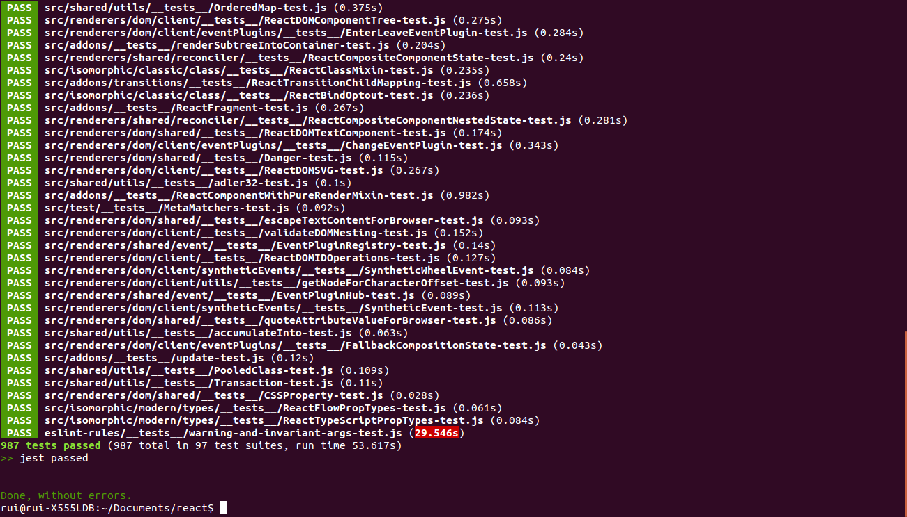

# Relatório 4 - ESOF
## Facebook/React - Verificação e Validação de *Software*

### <a name="introducao"></a>Introdução

O objetivo deste relatório consiste na análise dos processos de verificação e validação (V&V) seguidos no desenvolvimento da biblioteca React, com a descrição de algumas das características deste projeto que digam respeito à aplicação desses processos.

Numa primeira fase, explorar-se-á o grau de testabilidade do *software*, analisando a [controlabilidade](#controllability) do estado dos componentes testados, a [observabilidade](#observability) dos resultados e a [isolabilidade](#isolateability) dos componentes, bem como o grau de [separação](#separation) de funcionalidades, de [inteligibilidade](#understandability) dos componentes e de [heterogeneidade](#heterogeneity) das tecnologias utilizadas.

Numa segunda fase, serão apresentadas algumas estatísticas pertinentes relacionadas com a verificação e validação do *software* na biblioteca React.

Finalmente, serão apresentados os resultados do exercício, levado a cabo pelos autores deste relatório, que consistiu na seleção de um *bug report* a partir da lista de *issues* do projeto, na conceção de casos de teste para a sua reprodução e na correção efetiva do erro.

### <a name="testabilidade"></a>Testabilidade do *Software*

A discussão que se desenrolará nesta secção incidirá sobre o grau de testabilidade do projeto React, analisando a possibilidade de aplicação de processos de verificação e validação de *software* ao mesmo. A discussão será acompanhada de exemplos e de referências que suportem a interpretação dos autores, sempre que tal for considerado pertinente.

#### <a name="controllability"></a>Controlabilidade

Os dois tipos de teste mais relevantes no contexto da biblioteca React são os testes unitários e os testes de integração.

O React define um conjunto de classes que implementam a funcionalidade desta biblioteca, tirando partido do suporte à programação orientada por objetos oferecido pelo JavaScript. Uma vez que é possível aceder, num dado instante, às [propriedades](http://www.w3schools.com/js/js_properties.asp) de um objeto, que podem ser atributos ou métodos, parece razoável admitir que é possível controlar o estado do mesmo, já que é possível conhecê-lo em cada momento. Visto que os testes unitários são realizados ao nível da classe e do método, é possível afirmar que, para esse tipo de testes, o estado do componente que está a ser testado é controlável. Os testes unitários sobre a biblioteca React são realizados com [Jest](https://facebook.github.io/jest/), como será explorado nas subsecções seguintes.

Outro tipo de testes que são realizados sobre a biblioteca React são os testes de integração que fazem uso da ferramenta [Travis CI](https://travis-ci.org/), conforme referido adiante. Estes testes aplicam-se a um conjunto de módulos, que podem ser classes. Neste caso, podemos definir o estado de um conjunto de módulos como sendo uma instanciação possível do conjunto das classes definidas no mesmo. Uma vez que é possível conhecer o estado de cada objeto, conforme discutido no parágrafo anterior, também é possível conhecer o estado dessa instanciação, o que faz com que, neste caso, o componente a ser testado também seja controlável.

#### <a name="observability"></a>Observabilidade

Como já foi referido anteriormente, as duas ferramentas usadas pelos colaboradores do projeto React, para efeitos de teste, são o [Jest](https://facebook.github.io/jest/), para [testes unitários](https://en.wikipedia.org/wiki/Unit_testing), e o [Travis CI](https://travis-ci.org/), para [testes de integração](https://en.wikipedia.org/wiki/Integration_testing).

O Jest é uma *framework* para a definição de testes unitários desenvolvida pelo Facebook e é a principal ferramenta do género usada no projeto React, surgindo como uma extensão à *framework* [Jasmine](http://jasmine.github.io/edge/introduction.html). Entre as suas principais características, destaca-se o facto de permitir o [isolamento](http://facebook.github.io/jest/docs/automatic-mocking.html) de uma unidade de código, como será discutido na subsecção seguinte, e a execução de testes em processos paralelos, o que poderá contribuir para um melhor desempenho. A imagem seguinte refere-se às informações que são apresentadas aquando da execução de uma suíte de testes unitários com Jest.

<a name="results"></a>

A ferramenta Travis CI foi já apresentada no [Relatório 2](./Relatorio_2.md#validacao). É utilizada para realizar testes de integração sobre o código submetido pelos colaboradores do projeto em *pull requests*, conforme explicado nesse relatório. Na página da ferramenta, é possível ver o resultado dos testes realizados, como mostra o [seguinte exemplo](https://travis-ci.org/facebook/react/builds/92171038), que diz respeito ao código submetido pelos autores deste relatório num *pull request*, como será descrito na secção [Correção de *Bug*](#opcional). Cada teste é composto por um conjunto de *jobs* associados, isto é, um conjunto de tarefas que o constituem. [Este *job*](https://travis-ci.org/facebook/react/jobs/92171040) faz parte do teste cujo resultado foi mostrado acima e consistiu na execução do Jest sobre uma suíte de testes unitários que cobre todos os componentes da arquitetura da biblioteca, registando informações relevantes num *log*.

Conclui-se, desta forma, que é possível observar e recolher informação útil sobre os resultados dos testes que são realizados sobre a biblioteca React.

#### <a name="isolateability"></a>Isolabilidade

Um dos principais desafios na definição de testes unitários reside no isolamento de cada componente, isto é, na definição de testes cujo resultado não seja condicionado por eventuais dependências exteriores à unidade de código a ser testada. É neste capítulo que a ferramenta Jest se revela particularmente útil, pois permite o [isolamento](https://facebook.github.io/jest/docs/automatic-mocking.html) da unidade a ser testada através da definição de *mocks*, isto é, de funções que substituirão funções reais definidas em módulos dos quais essa unidade depende.

Estas [funções](https://facebook.github.io/jest/docs/mock-functions.html) são definidas automaticamente, embora também seja possível defini-las [manualmente](https://facebook.github.io/jest/docs/manual-mocks.html) sempre que for necessário. A [API](https://facebook.github.io/jest/docs/api.html#content) do Jest define funções que permitem, por exemplo, simular [valores de retorno](https://facebook.github.io/jest/docs/mock-functions.html#mock-return-values) das funções *mock*, alterar a sua [implementação](https://facebook.github.io/jest/docs/mock-functions.html#mock-implementations), ou testar a forma como as mesmas são [chamadas](https://facebook.github.io/jest/docs/mock-functions.html#custom-matchers), nomeadamente o número de vezes em que tal ocorre e o número e valor dos argumentos.

Assim, é possível concluir que, ao ser usada a *framework* Jest para a definição e execução de testes unitários, é possível isolar o componente que está a ser testado, fazendo uso da funcionalidade referida.

#### <a name="separation"></a>Separação de Funcionalidades

Ao desenvolver *software*, é importante garantir que cada funcionalidade implementada fique confinada, o mais possível, ao componente ao qual diz respeito, sob pena de o código resultar mais confuso e, por conseguinte, menos testável. Com efeito, em projetos de dimensão considerável, como é o do React, deve ser dada particular atenção a este aspeto, por forma a evitar a ocorrência de código desestruturado, que dificulta, a médio e a longo prazo, a sua manutenção.

De uma forma geral, a biblioteca React apresenta uma separação de funcionalidades bem definida, característica que está patente na organização de todo o projeto. Tome-se o exemplo da [renderização de páginas](https://github.com/facebook/react/tree/master/src/renderers/dom). A renderização de uma página Web pode ser realizada quer no lado do cliente, quer no lado do servidor, ocorrendo de maneira diferente em ambos os casos. Existe, assim, uma separação de funcionalidades que é necessário frisar. Assim, essas duas funcionalidades são implementadas em diferentes *packages*, que se traduzem em diretórios distintos. Por outro lado, também é importante isolar o conjunto de funcionalidades que são comuns ao cliente e ao servidor, com o principal intuito de evitar a repetição de código, promovendo a sua [reutilização](https://en.wikipedia.org/wiki/Code_reuse). Desta forma, reduz-se o risco de incoerências. Assim, o *package* [*shared*](https://github.com/facebook/react/tree/master/src/renderers/dom/shared) contém as funcionalidades que serão usadas tanto no lado do cliente como no lado do servidor. 

É importante notar que a separação de funcionalidades facilita o [isolamento](#isolateability) do componente a ser testado, aspeto fulcral na definição de testes unitários, conforme discutido na subsecção anterior.

#### <a name="understandability"></a>Inteligibilidade

Durante a conceção de uma suíte de testes, é importante conhecer a funcionalidade dos componentes que estão a ser testados. Contudo, esse conhecimento só é possível caso exista uma documentação bem estruturada que torne os componentes facilmente inteligíveis. Em projetos de dimensão considerável, essa documentação possui uma importância acrescida, uma vez que facilita a compreensão do código e a separação de funcionalidades, promovendo a consistência.

A biblioteca React apresenta uma [documentação](https://facebook.github.io/react/docs/top-level-api.html) dos vários serviços fornecidos que, do ponto de vista dos autores deste relatório, é extensiva, embora mantendo-se concisa. Para além desta documentação, é possível encontrar, ao longo do código, vários elementos, como comentários e nomes autoexplicativos, que facilitam o conhecimento global do projeto, assim como de cada componente em particular.

A documentação da biblioteca React é bastante satisfatória, aspeto muito importante para o processo de verificação e validação de *software*.

#### <a name="heterogeneity"></a>Heterogeneidade

Uma vez que o React é uma biblioteca *open-source*, e, por conseguinte, aberta a contribuições de vários colaboradores, é necessário garantir que, após a incorporação do código modificado submetido num dado *pull request*, o sistema permanece globalmente funcional.

Por um lado, a realização de testes unitários permite garantir o correto funcionamento dos componentes da biblioteca. Por outro lado, é preciso averiguar se a integração dos vários componentes é feita de forma correta, surgindo a necessidade de realizar testes de integração. Como já foi referido anteriormente, a ferramenta [Jest](https://facebook.github.io/jest/) é usada para automatizar os testes unitários e a ferramenta [Travis CI](https://travis-ci.org/facebook/react) é usada para automatizar os testes de integração.

Assim, conclui-se que a utilização de um [repositório do GitHub](https://github.com/facebook/react) aberto a vários colaboradores resulta numa heterogeneidade das ferramentas de teste utilizadas.

### <a name="estatisticas"></a>Estatísticas de Teste

> "Test coverage analysis is an important tool that any development team taking testing seriously should use."

> [Arie van Deursen, 2013](http://avandeursen.com/2013/11/19/test-coverage-not-for-managers/). 

A análise às estatísticas obtidas a partir dos testes realizados permite perceber se os mesmos foram bem concebidos, o que é muito importante para o sucesso de um projeto. No React, um projeto de grande dimensão e de importância crescente, este aspeto é particularmente relevante. Nesta secção, serão apresentadas algumas estatísticas de cobertura dos testes realizados sobre a biblioteca React.

Os autores deste relatório utilizaram a ferramenta [istanbul](http://gotwarlost.github.io/istanbul/) como extensão à *framework* Jest para gerar as estatísticas de cobertura dos testes unitários sobre o React que são mostradas na imagem seguinte.


A imagem acima permite constatar que a cobertura dos testes sobre o React ultrapassa os 87% ao nível das instruções (*statements*), das funções (*functions*) e das linhas (*lines*) e os 71% ao nível dos *branches*, isto é, ao nível dos [caminhos de execução](https://en.wikipedia.org/wiki/Decision-to-decision_path) - por exemplo, em instruções *if-then-else*. Os dados de cobertura parecem ser bastante satisfatórios para um projeto da dimensão do React.

### <a name="opcional"></a>Correção de *Bug*

Após analisar o grau de testabilidade da biblioteca React, procedeu-se à seleção de um *bug* a partir da lista de *issues* do projeto e à conceção de casos de teste capazes de o reproduzir. O *bug* foi corrigido pelos autores deste relatório. Nesta secção, são apresentados alguns pormenores desse trabalho.

O *bug* escolhido foi assinalado pela primeira vez [neste](https://github.com/facebook/react/issues/5468) *bug report*. Com o React, é possível definir classes de elementos que farão parte da Vista, conforme foi explicado no [Relatório 2](Relatorio_2.md#casos-de-uso). Cada classe pode ter campos, opcionais ou obrigatórios, conhecidos como *props* na nomenclatura do React. Podem ser definidos os tipos de dados, designados de [**PropTypes**](http://facebook.github.io/react/docs/reusable-components.html#prop-validation), esperados para cada *prop*, o que permitirá a validação destes campos quando os mesmos forem passados a um objeto da classe. Esses tipos podem ser primitivos ou compostos e são definidos com o recurso a funções da API do React, como mostra o exemplo seguinte para um tipo de dados enumerado.

```javascript
// You can ensure that your prop is limited to specific values by treating
// it as an enum.
optionalEnum: React.PropTypes.oneOf(['News', 'Photos']),
```

No exemplo acima, a função `React.PropTypes.oneOf()` deverá receber, como parâmetro, um *array* contendo o conjunto de valores possíveis que define o tipo de dados enumerado. Caso a função receba um objeto que não seja um *array*, deverá escrever um aviso na consola do *browser*. No entanto, antes da alteração realizada pelos autores deste relatório, esse aviso só era lançado no momento em que um objeto de uma dada classe anteriormente definida fosse instanciado e renderizado no DOM da página. Após a correção proposta, eventuais situações de erro como a descrita são assinaladas mais cedo, nomeadamente no momento em que a classe é criada, ou, mais genericamente, no momento em que a função `React.PropTypes.oneOf()` é chamada. Esta verificação também se passou a aplicar à função `React.PropTypes.oneOfType()`, que define vários tipos possíveis para um dado *prop*.

Adicionalmente, foi criado [um caso de teste](https://github.com/rppc/react/blob/changed/src/isomorphic/classic/class/__tests__/ReactClass-test.js#L384) para a reprodução do *bug*. Os casos de teste realizados sobre a [primeira](https://github.com/rppc/react/blob/changed/src/isomorphic/classic/types/__tests__/ReactPropTypes-test.js#L571) e [segunda](https://github.com/rppc/react/blob/changed/src/isomorphic/classic/types/__tests__/ReactPropTypes-test.js#L639) funções apresentadas no parágrafo anterior foram alterados de forma a contemplarem o lançamento de avisos sempre que os argumentos são dados como inválidos.

Após realizada a correção, os autores deste relatório submeteram [um *pull request*](https://github.com/facebook/react/pull/5476), com vista à integração da mesma no projeto. À data deste relatório, os autores aguardam o resultado da apreciação do *pull request* por parte da *core team*.

### <a name="analise"></a>Análise Crítica

De um modo geral, nota-se uma clara preocupação por parte da *core team* do React em sistematizar e automatizar a componente de verificação e validação de *software*, recorrendo a duas ferramentas essenciais neste processo, o Jest e o Travis CI.

O Jest revela-se muito útil no que diz respeito ao isolamento da unidade de código a ser testada, através de uma funcionalidade designada de *mocking*, como foi explicado [anteriormente](#isolateability). No entanto, a ferramenta parece estar muito pouco otimizada, sendo esta uma das principais críticas apontadas pela comunidade. Os autores deste relatório também se depararam com esse problema. [Esta imagem](#results), apresentada anteriormente, mostra que um conjunto de 987 testes demorou cerca de 54 segundos a ser executado, um número que é pouco apelativo e que poderá, em certas condições, inviabilizar a utilização do Jest.

Conforme já fora discutido em relatórios anteriores, o projeto encontra-se bem estruturado, existindo um claro delineamento das funcionalidades que cada componente deverá implementar. Este aspeto permite que os testes sejam mais eficazes ao nível do isolamento da unidade de código a testar.

A API da biblioteca encontra-se bem documentada e todo o código, para além de ser autoexplicativo, está devidamente comentado, o que permite uma melhor compreensão do componente que está a ser testado e uma mais fácil integração de novos colaboradores no projeto.

A integração contínua das contribuições dos vários colaboradores do projeto é possibilitada pela ferramenta Travis CI, que desempenha um papel muito útil ao nível da realização de testes de integração sobre o código submetido em *pull requests*.

### <a name="info"></a>Informações

##### Autores:

* António Casimiro (antonio.casimiro@fe.up.pt)
	* Número de horas despendidas: 8
	* Contribuição: 25%
* Diogo Amaral (diogo.amaral@fe.up.pt)
	* Número de horas despendidas: 8
	* Contribuição: 25%
* Pedro Silva (pedro.silva@fe.up.pt)
	* Número de horas despendidas: 8
	* Contribuição: 25%
* Rui Cardoso (rui.peixoto@fe.up.pt)
	* Número de horas despendidas: 8
	* Contribuição: 25%

Faculdade de Engenharia da Universidade do Porto - MIEIC

2015-11-22
