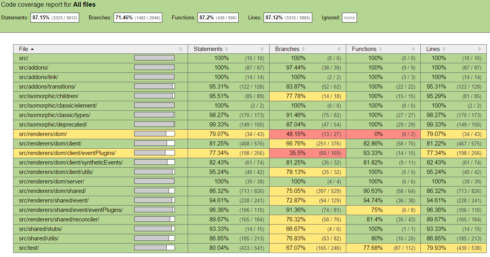

# Relatório 4 - ESOF
## Facebook/React - Verificação e Validação de Software

### <a name="introducao"></a>Introdução

O objetivo deste relatório consiste na análise dos processos de verificação e validação (V&V) seguidos no desenvolvimento da biblioteca React, com a descrição de algumas das características deste projeto que digam respeito à aplicação desses processos.

Numa primeira fase, explorar-se-á o grau de testabilidade do *software*, analisando a [controlabilidade](#controllability) do estado dos componentes, a [observabilidade](#observability) dos resultados e a [isolabilidade](#isolateability) dos componentes, assim como o grau de [separação](#separation) de funcionalidades, de [inteligibilidade](#understandability) dos componentes e de [heterogeneidade](#heterogeneity) das tecnologias utilizadas.

Numa segunda fase, serão apresentadas algumas estatísticas pertinentes relacionadas com a verificação e validação do *software*.

Finalmente, será realizado um exercício que consistirá na seleção de um *bug report* e na conceção de casos de teste que possam, eventualmente, conduzir à resolução do mesmo.

### <a name="testabilidade"></a>Testabilidade do *Software*

A discussão que se desenrolará nesta secção incidirá sobre o quão testável o projeto React é, isto é, até que ponto é possível verificar e validar a implementação da biblioteca. É de notar que tal discussão será acompanhada de exemplos e de referências que suportem a interpretação dos autores sempre que for considerado pertinente.

#### <a name="controllability"></a>Controlabilidade

A biblioteca React define um conjunto de classes que implementam a sua funcionalidade, tirando partido do suporte à programação orientada por objetos, baseada na definição de protótipos, oferecido pelo JavaScript. Uma vez que é possível aceder, num dado instante, às [propriedades](http://www.w3schools.com/js/js_properties.asp) de um objeto, que podem ser atributos ou métodos, parece razoável admitir que é possível controlar o estado do mesmo, já que é possível conhecê-lo em cada momento. Visto que os testes unitários são realizados ao nível da classe e do método, é possível afirmar que, para esse tipo de testes, o estado do componente que está a ser testado é controlável. Os testes unitários sobre a biblioteca React são realizados com [Jest](https://facebook.github.io/jest/), como será explorado nas subsecções seguintes.

Outro tipo de testes que são realizados sobre a biblioteca React são os testes de integração que fazem uso da ferramenta [Travis CI](https://travis-ci.org/), conforme referido adiante. Estes testes são realizados ao nível de um conjunto de módulos, por exemplo, ao nível do pacote. Neste caso, podemos definir o estado de um pacote como sendo uma instanciação possível do conjunto das classes definidas no mesmo. Uma vez que é possível conhecer o estado de cada objeto, conforme discutido no parágrafo anterior, também é possível conhecer o estado dessa instanciação, o que faz com que, neste caso, o componente a ser testado também seja controlável.

Estes são os dois tipos de teste mais relevantes no contexto da biblioteca React.

#### <a name="observability"></a>Observabilidade

Como já foi referido anteriormente, as duas ferramentas usadas pelos colaboradores do projeto React, para efeitos de teste, são o [Jest](https://facebook.github.io/jest/), para [testes unitários](https://en.wikipedia.org/wiki/Unit_testing), e o [Travis CI](https://travis-ci.org/), para [testes de integração](https://en.wikipedia.org/wiki/Integration_testing).

O Jest é uma *framework* para a definição de testes unitários desenvolvida pelo Facebook e é a principal ferramenta do género usada no projeto React, surgindo como uma extensão à *framework* [Jasmine](http://jasmine.github.io/edge/introduction.html). Entre as suas principais características, destaca-se o facto de permitir o [isolamento](http://facebook.github.io/jest/docs/automatic-mocking.html) de uma unidade de código, como será discutido na subsecção seguinte, e a execução de testes em processos paralelos, o que resulta num melhor desempenho em geral. Esta ferramenta permite recolher informação sobre o resultado de um teste, como mostra o seguinte exemplo:

> npm test  
> [PASS] jest/examples/\__tests__/fetchCurrentUser-test.js (0.075s)

A ferramenta Travis CI foi já apresentada no [Relatório 2](./Relatorio_2.md#validacao). É utilizada para realizar testes de integração sobre o código submetido pelos colaboradores do projeto em *pull requests*, conforme explicado nesse relatório. Na página da ferramenta, é possível ver o resultado de alguns dos testes realizados, como mostra o [seguinte exemplo](https://travis-ci.org/facebook/react/builds/90839775). Cada teste é composto por um conjunto de *jobs* associados, isto é, um conjunto de tarefas que constituem o teste. [Nesta página](https://travis-ci.org/facebook/react/jobs/90839776), podem ser encontradas informações sobre um dos *jobs* do teste de exemplo referido acima, nomeadamente o *log* resultante da execução do teste, contendo os respetivos resultados. Note-se que um teste de integração com Travis CI pode, eventualmente, envolver a execução de testes unitários com Jest, como mostra o *log* [deste *job*](https://travis-ci.org/facebook/react/jobs/90839777).

Conclui-se, desta forma, que é possível observar e recolher informação útil sobre os resultados dos testes que são realizados sobre a biblioteca React.

#### <a name="isolateability"></a>Isolabilidade

Um dos principais desafios na definição de testes unitários reside no isolamento de cada componente, isto é, a definição de testes cujo resultado não seja condicionado por eventuais dependências exteriores à unidade de código a ser testada. É neste capítulo que a ferramenta Jest se revela particularmente útil, pois permite o [isolamento](https://facebook.github.io/jest/docs/automatic-mocking.html) da unidade a ser testada através da definição de *mocks*, isto é, de funções que substituirão as reais, definidas nos módulos dos quais a unidade depende.

Estas [funções](https://facebook.github.io/jest/docs/mock-functions.html) são definidas automaticamente, embora também seja possível defini-las [manualmente](https://facebook.github.io/jest/docs/manual-mocks.html), sempre que for necessário. A [API](https://facebook.github.io/jest/docs/api.html#content) do Jest define funções que permitem, por exemplo, simular [valores de retorno](https://facebook.github.io/jest/docs/mock-functions.html#mock-return-values) das funções *mock*, alterar a sua [implementação](https://facebook.github.io/jest/docs/mock-functions.html#mock-implementations), ou testar a forma como as mesmas são [chamadas](https://facebook.github.io/jest/docs/mock-functions.html#custom-matchers), nomeadamente o número de vezes em que tal ocorre e o número e valor dos argumentos.

Assim, é possível concluir que, no caso da biblioteca React, ao ser usada a *framework* Jest para a definição e execução de testes unitários, é possível isolar o componente que está a ser testado, fazendo uso da funcionalidade referida.

#### <a name="separation"></a>Separação de Funcionalidades

Ao desenvolver uma dada classe ou componente, é importante garantir que a funcionalidade atribuída fique confinada, o mais possível, ao elemento a que diz respeito, sob pena de tornar o código mais confuso e, por conseguinte, menos testável. Com efeito, em projectos de dimensão considerável, este aspecto deve ser tomado em consideração por todos os elementos das equipas envolvidas no projecto, por forma a evitar a existência de [*Spaghetti code*](https://en.wikipedia.org/wiki/Spaghetti_code), que dificulta, a médio e a longo prazo, a manutenção do projecto.

De uma forma geral, a biblioteca React apresenta uma separação de funcionalidades bem definida, característica essa que está patente na organização de todo o projecto. Repare-se no exemplo de [renderização das páginas](https://github.com/facebook/react/tree/master/src/renderers/dom). A renderização de uma página web pode ser realizada quer no lado do cliente, quer no lado do servidor (esta última possibilitada através de [isomorfismo](./Relatorio_2.md#levantamento)); contudo, é efectuada de maneira diferente, consoante a entidade em questão. Tem-se, assim, uma separação importante da funcionalidade que é importante frisar, e que a *core-team* decidiu implementar através da criação de vários *packages*, expostos sob a forma de *folders*. 
Por outro lado, é também importante isolar o conjunto de funcionalidades que são comuns quer no lado do cliente quer no servidor, com o principal intuito de evitar a repetição de código ([DRY](https://en.wikipedia.org/wiki/Don%27t_repeat_yourself)) e promover a [reutilização de código](https://en.wikipedia.org/wiki/Code_reuse), por forma a evitar, ao máximo, a introdução de *bugs* e de incoerências no projecto. No React, o *package* *shared* contém, assim, os elementos que são utilizados por quaisquer das entidades já referidas (cliente ou servidor). 

É importante notar que a separação de funcionalidades facilita o [isolamento](#isolateability) do elemento na fase de testes, o que permite testar o código de forma mais incisiva e cobrir um maior número de situações de teste, tópico este já abordado na secção superior.

#### <a name="understandability"></a>Inteligibilidade

Em projectos de dimensão considerável, a componente de documentação possui um peso bastante considerável, já que é capaz de garantir a consistência de uso dos vários elementos disponibilizados.

A biblioteca React [apresenta uma API](https://facebook.github.io/react/docs/top-level-api.html) dos vários recursos, que, no ponto de vista dos autores do relatório, é bastante extensiva e concisa. Para além desta documentação, é possível encontrar, ao longo do código, vários elementos (comentários, nomes de variáveis, ...), que permitem um maior esclarecimento das entidades aí presentes, tal como se verifica [neste exemplo](https://github.com/facebook/react/blob/master/src/renderers/dom/client/ReactMount.js).

Durante o desenvolvimento de um *test suite*, é importante conhecer a funcionalidade dos vários elementos. Contudo, esse conhecimento só é possível de ser adquirido caso exista uma documentação bem estruturada, daí a importância dessa documentação relativa aos elementos a serem testados. Desta forma, é possível cobrir um maior número de casos a testar, e, por conseguinte, averiguar a robustez do código.

Em suma, a biblioteca React apresenta uma documentação API bastante satisfatória, aspecto bastante importante durante a fase de Verificação e Validação de *Software*.

#### <a name="heterogeneity"></a>Heterogeneidade

Uma vez que o React é uma biblioteca *open-source*, e, por conseguinte, sujeita a contribuições de vários programadores, é necessário garantir que, após a aceitação e a incorporação das modificações dos *pull-requests*, o sistema permanece funcional. Desta forma, é testada a integrabilidade do sistema, em paralelo com a realização de testes unitários incidentes nos vários elementos da biblioteca.
Por um lado, a realização de testes unitários ao nível da classe permite garantir a consistência dos elementos da biblioteca, com o recurso à *framework* [Jest](https://facebook.github.io/jest/). Por outro lado, é preciso averiguar se a integração dos vários elementos é feita de forma correcta. Nesta vertente, é utilizada a ferramenta [Travis CI](https://travis-ci.org/facebook/react), que permite automatizar este processo.

Em conclusão, perante várias contribuições por parte de vários programadores, são utilizadas ferramentas de teste de integração, em paralelo com ferramentas de testes unitários.

### <a name="estatisticas"></a>Estatísticas de Teste

> "Test coverage analysis is an important tool that any development team taking testing seriously should use."

> Arie van Deursen, 2013. 

Um importante elemento para o sucesso de um projeto consiste na geração de testes e na respetiva análise às estatísticas obtidas. No React, um projeto de elevada dimensão e importância, as estatísticas de teste são fundamentais para manter o rumo correto e permite a resolução dos problemas e erros que surjam.

#### <a name="travis"></a>Travis CI

Travis CI consiste numa ferramenta muito versátil e útil para este projeto. Na sua vertente [Travis Logs](https://github.com/travis-ci/travis-logs), processa atualizações do log que são transmitidos de outra vertente, [Travis Worker](https://github.com/travis-ci/worker), via [RabbitMQ](http://www.rabbitmq.com/), um programa *open-source* [intermediário para envio de mensagens](https://en.wikipedia.org/wiki/Message_broker). Uma vez que todas as peças de log forem recebidas, e passado um tempo limite padronizado de 10 segundos, estas peças são agregadas num log final.

#### <a name="jest"></a>Jest

A *framework* [Jest](https://facebook.github.io/jest/), ferramenta para testes unitários do [Facebook](https://github.com/facebook/), é utilizada para testar as aplicações React de forma simples. Estes [testes](http://facebook.github.io/react/docs/test-utils.html) manipulam componentes do React averiguando o seu comportamento. Para um teste unitário operar numa unidade isolada da aplicação é necessário proceder ao *mock* de todos os módulos exceto aquele que está a ser testado. Jest constrói o *mocking* das partes de uma aplicação [Flux](https://facebook.github.io/flux/) trivial. Flux é a arquitetura da aplicação que o [Facebook utiliza](https://github.com/facebook/jest/blob/fd33aad1da1ed430b656719c7a0e00bb7952c6df/docs/TutorialReact.md) para construir aplicações *web* com o React.

#### <a name="cobertura"></a>Cobertura dos Testes

De forma a conseguir estudar a cobertura do projeto React, utilizou-se a ferramenta [istanbul](http://gotwarlost.github.io/istanbul/), que permite testar a cobertura de um código JavaScript.



A partir da imagem acima, que testa todos os ficheiros presentes na pasta src do React, pode-se constatar que a cobertura a todos os projetos do React ultrapassa os 87% para os *statements*, para as *functions* e para as *lines* e 71% para os *branches*. Considera-se a cobertura razoável, sendo percetível pela imagem acima, para um projeto com a dimensão do React.

### <a name="opcional"></a>Correção de *Bug*

Após analisar o grau de testabilidade da biblioteca React, procedeu-se à seleção de um *bug* a partir da lista de *issues* do projeto e à conceção de casos de teste capazes de o reproduzir. O *bug* foi corrigido pelos autores deste relatório. Nesta secção, são apresentados alguns pormenores desse trabalho.

O *bug* escolhido foi assinalado pela primeira vez [neste](https://github.com/facebook/react/issues/5468) *bug report*. Com o React, é possível definir classes de elementos que farão parte da Vista, conforme já discutido no [Relatório 2](Relatorio_2.md#casos-de-uso). Cada classe pode ter campos, opcionais ou obrigatórios, conhecidos como *props* na nomenclatura do React. Cada *prop* pertence a um determinado tipo de dados, designado de [**PropType**](http://facebook.github.io/react/docs/reusable-components.html#prop-validation), cuja definição permitirá a sua validação quando for passado a um objeto da classe. Esses tipos podem ser tipos primitivos ou definidos com o recurso a funções da API do React, como mostra o exemplo seguinte para um tipo de dados enumerado.

```javascript
// You can ensure that your prop is limited to specific values by treating
// it as an enum.
optionalEnum: React.PropTypes.oneOf(['News', 'Photos']),
```

No exemplo acima, a função `React.PropTypes.oneOf()` deverá receber, como parâmetro, um *array* contendo o conjunto de valores possíveis que define o tipo de dados enumerado. Caso a função receba um objeto que não seja um *array*, deverá escrever um aviso na consola do *browser*. No entanto, antes da alteração realizada pelos autores deste relatório, esse aviso só era lançado no momento em que um objeto de uma dada classe anteriormente definida fosse instanciado e renderizado no DOM da página. Após a correção proposta, eventuais situações de erro como a descrita são assinaladas mais cedo, nomeadamente no momento em que a classe é criada, ou, mais genericamente, no momento em que a função `React.PropTypes.oneOf()` for chamada. Esta verificação também se passou a aplicar à função `React.PropTypes.oneOfType()`.

Adicionalmente, foi criado [um caso de teste](https://github.com/rppc/react/blob/changed/src/isomorphic/classic/class/__tests__/ReactClass-test.js#L384) para reprodução do *bug*. Os casos de teste realizados sobre a [primeira](https://github.com/rppc/react/blob/changed/src/isomorphic/classic/types/__tests__/ReactPropTypes-test.js#L570) e [segunda](https://github.com/rppc/react/blob/changed/src/isomorphic/classic/types/__tests__/ReactPropTypes-test.js#L638) funções descritas no parágrafo anterior foram alterados de forma a contemplarem o lançamento de avisos sempre que os argumentos são dados como inválidos.

Após realizada a correção, os autores deste relatório submeteram [um *pull request*](https://github.com/facebook/react/pull/5476), com vista à integração da mesma no projeto. À data deste relatório, os autores aguardam o resultado da apreciação do *pull request* por parte da *core team*.

### <a name="analise"></a>Análise Crítica

####[controlabilidade](#controllability)
 podemos concluir que o projecto React utiliza duas ferramentas, Jest e Travis CI, que irão garantir que o seu código está dividamente desenvolvido.Para tal recorre-se ao uso de testes exaustivos para garantir o menor número posível de erros no programa.

####[Observabilidade](#observability)

####[isolabilidade](#isolateability) 

O uso do [Jest](https://facebook.github.io/jest/) tem um grande contributo nesta secção. Graças a esta ferramente, é possível testar especificamente o módulo desejado pelos *developers*, sem que o uso de funções externas ao módulo em causa seja uma variável ao teste, através do *mocks*, como descrito anteriormente.

####[separação](#separation) 

Os responsáveis pelo React, foram, ao longo do tempo que despenderam no projecto, promovendo o uso de boas práticas de programação para garantir que o código estaria o mais organizado possível, mesmo com a adição de novos membros na ajuda.
Para isso, recorreram ao uso de funções genéricas para evitar o uso de código repetido e criação de funções específicas tanto para o cliente como para o servidor. 

####[inteligibilidade](#understandability) 

Mais uma vez, a *core-team* do React demonstra o seu rigor estrutural neste projeto, neste caso em relação à compreensão do código existente nesta biblioteca. Analisando todo código, é possível verificar o uso recorrente de comentários explicativos das funções apresentadas, por exemplo. Isto torna a tarefa de quem quer ajudar a crescer este proecto, algo muito mais fácil.

####[heterogeneidade](#heterogeneity)


### <a name="info"></a>Informações

##### Autores:

* António Casimiro (antonio.casimiro@fe.up.pt)
	* Número de horas despendidas:
	* Contribuição:
* Diogo Amaral (diogo.amaral@fe.up.pt)
	* Número de horas despendidas:
	* Contribuição:
* Pedro Silva (pedro.silva@fe.up.pt)
	* Número de horas despendidas:
	* Contribuição:
* Rui Cardoso (rui.peixoto@fe.up.pt)
	* Número de horas despendidas:
	* Contribuição:

Faculdade de Engenharia da Universidade do Porto - MIEIC

2015-11-22
